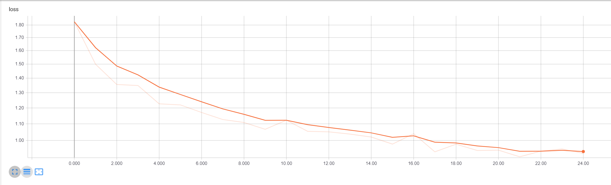
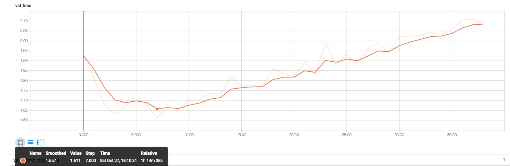
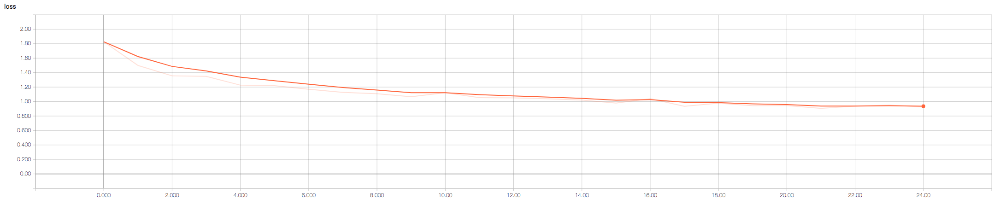
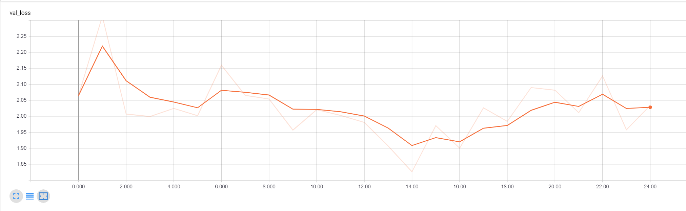

# Proof of Concept

The following files were used to verify the feasibility of our project and what our project can achieve. **extractROIs.py** and **assess.py** are scripts that the developers of this project used to prepare data for training and for sanity checks respectively. **inferencer.py** implements the command-line interface for users.

## Files and Directories

### books-annotation-classification-classifications-11June2018.csv

This csv files stores all the labeled data created from zooniverse users. The data includes
regions of interests that were labeled and provides some information of the user who marked
them. Further processing of this data is needed before it can be trained.

### books meta data.csv

This csv stores information of which images have annotations from 10 books that the UCLA
Collections Lab has archived. Notice that there is no labeled data of any coordinates where
these regions lay; there is only simple binary labeling.

### detectedImages/

This directory is where **inferencer.py** stores any splashed images if that boolean is set to True. Otherwise this remains an empty directory.

### extractROIs.py

This script takes the **books-annotation-classification-classifications-11June2018.csv** file
(hard-coded) and returns a JSON that contains all the images listed on zooniverse along with
all the regions that they may have. The JSON itself is a relatively complex object that stores
many images, and those images may themselves have lists of ROIs.

To put it simply, every image has a list of ROIs, and every ROI is made up of an "all_points_x"
array and an "all_points_y" array such that all_points_x[i] and all_points_y[i] make up a
coordinate point, where every region would have four of these coordinate points (to make a
rectangle that captures the ROI).

The way these ROIs are constructed as such due to the fact that the Mask-RCNN as released
on GitHub require that structure in order to do training.

$ python3 extractROIs.py

### graphs/

Stores images of the training and validation loss for the model trained on a small set of data
and for the model trained on the data collected from zooniverse.

#### Training Loss Curve for *m*small

#### Validation Loss Curve for *m*small

#### Training Loss Curve for *m*zooniverse

#### Validation Loss Curve for *m*zooniverse

### handwriting/

Contains a training set and a validation set for images that contain handwriting. These images come from the Collections Lab database. Note that training the model assumes daughter directories "train" and " val" where those directories contain only images.

### inferencer.py

This script is the engine that does all the handwriting detection. It currently takes a list of manifests via command line and will save all images referred by the manifest that it predicts has at least one region that contains handwriting.

The script will display information of its configuration for Mask R-CNN, the weights of the models it will use to infer, the manifest URI it is currently running on, the image URI it is currently inferring on, and confidence scores in range [0.96, 1] of any region it picks up (the higher the score, the more confident the model believes a region contains handwriting).

$ python3 inferencer.py https://marinus.library.ucla.edu/iiif/annotated/uclaclark_SB322S53.json https://marinus.library.ucla.edu/iiif/annotated/uclaclark_BF1681A441713.json

### logs/

This is a directory where weights and TFEvents are to be stored for the training and validation process. A TensorBoard session may use this directory to visualize model architectures along with plotting loss curves.

#### mask-rcnn/

This is the vanilla Mask-RCNN that is re-purposed for detecting handwriting. For more information, please refer to <https://github.com/matterport/Mask_RCNN>.

### regionURIs.txt

A list of images that was inferred to have handwriting. **inferencer.py** generates this text file. This is a sample file of what is generated when running the line in the **inferencer.py** section.

### requirements.txt

A list of dependencies needed to run this package. To be used as follows:

$ pip3 install -r requirements.txt

### weights/ (not shown here)

This stores all the weights of any models of interest. It currently stores the best weights for *m*small  and *m*zoo. (Note that these files tend to be large so they cannot be uploaded onto GitHub.)

## Current Issues to Address as of 2/18/19

* Need some way to ensure safe connections to manifest URIs (perhaps writing custom SSL certificates).

* Replacing the command-line interface with a web interface.
