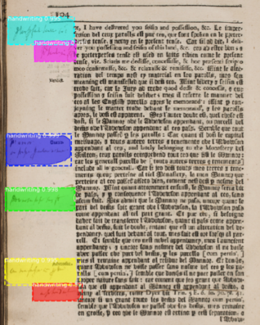
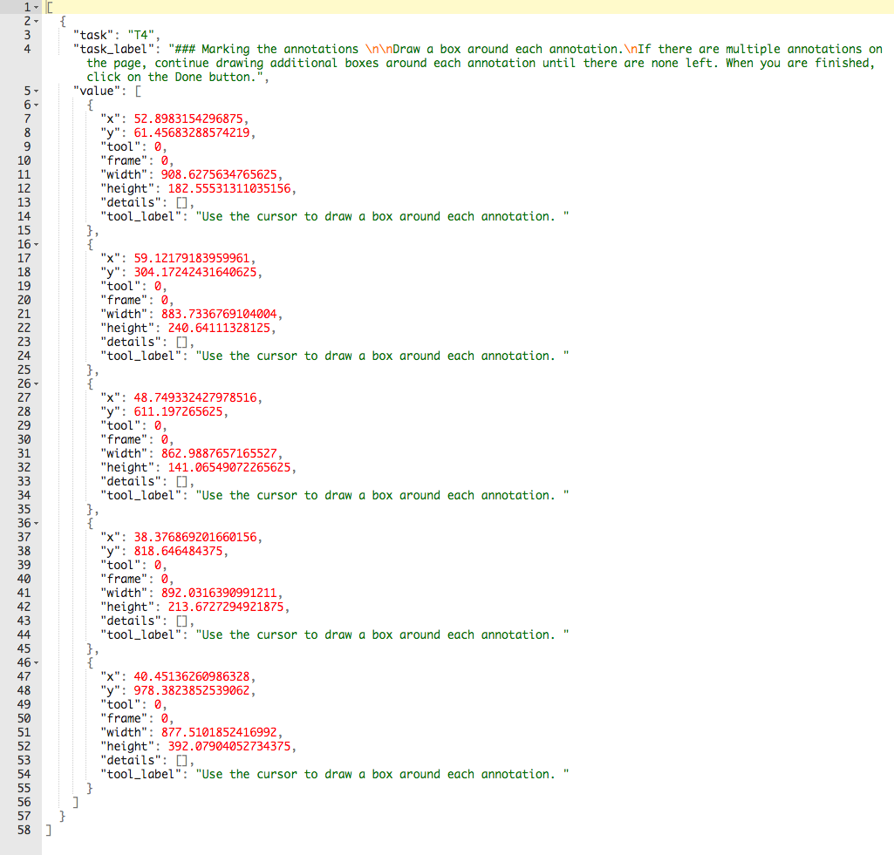
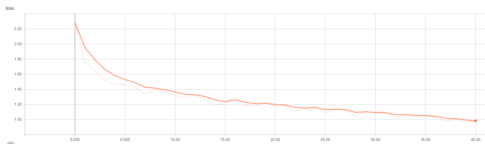
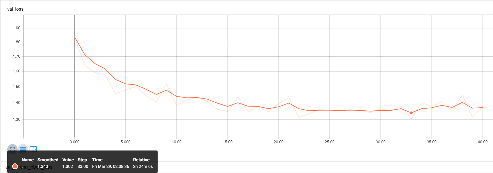
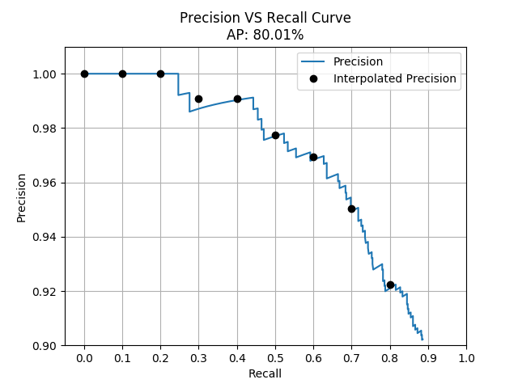

# Proof of Concept

The goal of this project is to investigate the learnability of some of the data that is owned by the Collections Lab team at UCLA. We have found that there are interesting machine learning applications with this data. For instance, we were able to train a model that was able to detect annotations that are written in printed books. To do this, we utilized Mask R-CNN, a regional convolutional neural network that excels in instance segmentation. In our case, the instances to be segmented away from the image are annotations (e.g. marginalia and interlinear annotations).



Resources:
<br> [Mask R-CNN Paper](https://arxiv.org/abs/1703.06870) <br>
[High Level Explanation of Mask R-CNN](https://medium.com/@jonathan_hui/image-segmentation-with-mask-r-cnn-ebe6d793272)

## The Pipeline

### 1. Gathering Data

To gather labeled data, we used [Zooniverse](https://www.zooniverse.org/), a crowd-sourcing platform where anyone can help draw bounding boxes on our collection of printed books. In total we had **4143** annotations across 1079 images. These annotations were exported and stored in `rawData.csv`.

### 2. Formatting the Raw Data

In order to leverage [Mask R-CNN](https://github.com/matterport/Mask_RCNN) to detect annotations, we need to provide the training data and validation data, namely the images and their corresponding regions of interests (ROIs). The data is formatted in a JSON as follows:

```javascript
{
    "Image1": {
        "imgName": "Image1.png",
        "regions": {
            "0": {
                "shape_attributes": {
                    "name": "polygon",
                    "all_points_x": [X1, X2, X2, X1],
                    "all_points_y": [Y1, Y1, Y2, Y2]
                }
            },
            "1": {
                "shape_attributes": {
                    "name": "polygon",
                    "all_points_x": [X1, X2, X2, X1],
                    "all_points_y": [Y1, Y1, Y2, Y2]
                }
            },
            "2": {
                "shape_attributes": {
                    "name": "polygon",
                    "all_points_x": [X1, X2, X2, X1],
                    "all_points_y": [Y1, Y1, Y2, Y2]
                }
            }
        }
    },
    "Image2": {
        "imgName": "Image2.png",
        "regions": {
            "0": {
                "shape_attributes": {
                    "name": "polygon",
                    "all_points_x": [X1, X2, X2, X1],
                    "all_points_y": [Y1, Y1, Y2, Y2]
                }
            },
            "1": {
                "shape_attributes": {
                    "name": "polygon",
                    "all_points_x": [X1, X2, X2, X1],
                    "all_points_y": [Y1, Y1, Y2, Y2]
                }
            }
        }
    }
    // ...
}
```

This JSON will have images as keys, where each image has a name and one or more regions (labeled bounding boxes) on that image.
While every region is labeled as a polygon, `all_points_x` and `all_points_y` store x and y coordinates that form a rectangle, which are the coordinates of the bounding boxes that Zooniverse volunteers have drawn for us.

In short, our data was presented like this: 

and we wrote `extractROIs.py` that generated a `data.json` file that formats the data to look more like this:
 

 Note that it is arbitrary of how this data is formatted. They could be stored in CSV or other desirable formats. We chose this format to reflect [VIA](http://www.robots.ox.ac.uk/~vgg/software/via/), an image annotation tool that also follows this convention.

### 3. Generating the datasets

 We wrote `datasetGenerator.py` to split `data.json` to have a roughly 70/15/15 split (70% of the annotations are for training, 15% of the annotations are for validation, and 15% of the annotations are for testing). This split is necessary in order to tune hyperparameters and ultimately prevent overfitting. With `SEED = 42`, we had **2901** annotations for training, **627** annotations for validation, and **615** annotations for testing.

### 4. Training the Model

 We used the pre-trained COCO weights that were trained using the ResNet-50 architecture as a backbone. Since we only had 4143 annotations, we used transfer learning to re-purpose the weights learned from the COCO dataset for our dataset. We favor this approach because the COCO weights were trained on over ~120k images. Consequently, these weights have acquired gradients that are much more representative of detecting low-level features such as lines and edges (i.e. the COCO weights have already learned what lines and edges are to a great degree).

#### Fine-Tuning for Detecting Handwriting

With the ResNet-50 as backbone for the model, we have it detect handwriting. In order to do so, we had the model trained over 40 epochs with a learning rate of 0.001, and a momentum value of 0.9. Every epoch consists of 100 training steps where it infers on the images in the training set before doing the validation step. The loss value of the last training step and the validation step were plotted on a curve generated by Tensorboard.

#### Training Loss Curve



#### Validation Loss Curve



#### Final Testing and Evaluating the Model

After 40 epochs, we found that the model had the least loss at the 34th epoch (the plot starts at 0 so it looks like epoch 33 is the best). This model would then be the model to infer on the test set. In order to evaluate the model, we used 11-point Interpolation Average Precision (with an IoU threshold of 0.95) as it is typically used for object detection like PASCAL VOC and COCO. This process calculates precision as a function of recall; the model is good if it has a high precision while increasing the recall value. This is because recall calculates how much of the ground truth was actually returned, while precision measures how much of the results were actually true. A model that maintains high precision while recall value is increasing indicates that the model performs well. For more information on the mathematical intuition, click [here](https://medium.com/@jonathan_hui/map-mean-average-precision-for-object-detection-45c121a31173).



We found that the model does maintain a high precision as the recall value increases. However, it was not able to detect a lot of interlinear annotations with an IoU threshold of 95%. This is likely due to the fact that most of the data consists of marginalia, so there is a bias towards detecting marginalia. We believe that if interlinear annotations were more equally represented with marginalia, then average precision would improve drastically. We also find that lowering the IoU threshold to 75% also helps in detecting interlinear annotations (at the cost of getting more false positives and decreasing average precision). Overall, we believe that most scholars would be more interested in marginalia as it contains more content than interlinear annotations, and we expect our users to be happy with using this model to speed up the process of finding all annotations in IIIF manifests.

### 5. Applying the Results

We released a [command line interface](https://github.com/collectionslab/Omniscribe/releases) that takes in IIIF manifests, detects all annotations from all the images from each manifest, and exports them to the user's desired format of .txt, .html, and/or .json. The weights file is also found there as a .h5 file for anyone to load a model with our weights.

## Files and Directories (Requires Python 3.6.x)

### `data.json`

The resulting file generated from `extractROIs.py`. It contains all the images with their labeled annotations from `rawData.csv`. It is to be used with `datasetGenerator.py` in order to generate datasets that are ready for training.

### `datasetGenerator.py`

This scripts reads `data.json` and generates three JSON files for training, validation, and testing. Each of these files have to be renamed to `via_region_data.json` and are to be placed in the same directory where the images they represent are located. Note that changing the `SEED` value will create different datasets.

### `extractROIs.py`

This script takes the `rawData.csv` file (hard-coded) and generates `data.json`, a JSON file that contains all the images listed on zooniverse along with all the regions that they may have. The JSON itself is a relatively complex object that stores many images, and those images may themselves have lists of ROIs.

To put it simply, every image has a list of ROIs, and every ROI is made up of an `all_points_x"`
array and an `all_points_y` array such that `all_points_x[i]` and `all_points_y[i]` make up a
coordinate point, where every region would have four of these coordinate points (to make a
rectangle that captures the ROI).

These ROIs are constructed as such due to the fact that the Mask R-CNN as released
on GitHub require that structure in order to do training.

`$ python3 extractROIs.py`

### handwriting/

Contains a training set and a validation set for images that contain handwriting. These images come from the Collections Lab database. Note that training the model assumes daughter directories "train" and " val" where those directories contain only images.

### `inferencer.py`

This script is the engine that does all the handwriting detection. It currently takes a list of manifests via command line and will save all images referred by the manifest that it predicts has at least one region that contains handwriting.

The script will display information of its configuration for Mask R-CNN, the weights of the models it will use to infer, the manifest URI it is currently running on, the image URI it is currently inferring on, and confidence scores in range [0.96, 1] of any region it picks up (the higher the score, the more confident the model believes a region contains handwriting).

`$ python3 inferencer.py https://marinus.library.ucla.edu/iiif/annotated/uclaclark_SB322S53.json`

#### mask-rcnn/

This is the vanilla Mask-RCNN that is re-purposed for detecting handwriting. For more information, please refer to <https://github.com/matterport/Mask_RCNN>.

### `rawData.csv`

This csv files stores all the labeled data created from zooniverse users. The data includes
regions of interests that were labeled and provides some information of the user who marked
them. Further processing of this data is needed before it can be trained.

### `requirements.txt`

A list of dependencies needed to run this package. To be used as follows:

`$ pip install -r requirements.txt`
